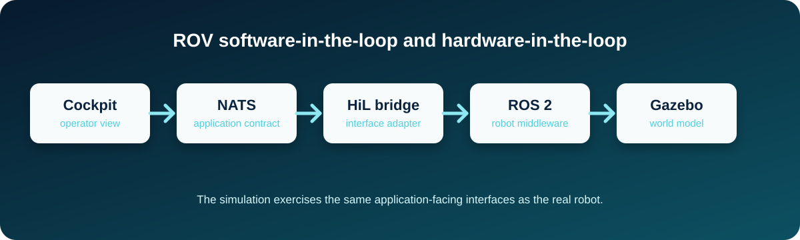

# SquidLink

[](LICENSE-POLYFORM-NonCommercial-1.0.0.txt)
[](LICENSE-CC-BY-NC-SA-4.0.txt)
[](https://www.ros.org/)
[](https://gazebosim.org/)
[](https://www.python.org/)

<p align="center">
  
</p>

SquidLink is the independent simulation and integration-test environment for the robot projects. Its primary purpose is to provide a ROS 2 and Gazebo software-in-the-loop (SiL) environment and, later, a hardware-in-the-loop (HiL) environment that exercises the same application-facing interfaces as the real robot.

## Robots project

Cross-project architecture, engineering rationale, significant decisions, reusable guidance, and the overall roadmap are maintained in [Chartroom](https://chartroom.philipmcgaw.com/).

- [Chartroom](https://chartroom.philipmcgaw.com/) — central engineering knowledge base and cross-project documentation.
- [CuttleOS](https://github.com/PhilipMcGaw/robot-CuttleOS) — robot-side software, including Cockpit, Control, and Datalogger.
- [NautiPi](https://github.com/PhilipMcGaw/robot-NautiPi) — physical electronics, PCB designs, embedded hardware projects, and associated hardware reference material.

The three engineering repositories are connected by documented interfaces. SquidLink is not the source of truth for CuttleOS implementation or NautiPi hardware allocation; Chartroom provides the cross-project engineering context.

## Architecture

```text
                 Robot application boundary

     Cockpit ───────────┐
                         │
     Control ────────────┼── NATS Core ── NATS/ROS 2 bridge ── ROS 2 ── Gazebo
                         │                                      │
     Datalogger ─────────┘                                      ▼
                                                         Simulated vehicle
                                                               │
                                                        Simulated sensors
```

NATS Core is the application-facing communication boundary. ROS 2 and Gazebo are implementation technologies inside SquidLink and MUST NOT become dependencies of CuttleOS services merely because they are used for simulation.

The simulator receives application commands, applies them to the simulated vehicle, and publishes simulated telemetry back through the same NATS contract. Control and safety logic remains in CuttleOS rather than being duplicated inside the simulator.

## Software-in-the-loop and hardware-in-the-loop

### Software-in-the-loop

SiL runs without the physical robot. CuttleOS services may be run separately in a development environment, while SquidLink provides the simulated vehicle and its ROS 2/Gazebo environment.

### Hardware-in-the-loop

HiL allows selected real hardware or software components to operate against the simulated vehicle. HiL is an architectural capability and is not currently evidence of physical validation unless an explicit test record says otherwise.

Both modes MUST use the same application-facing NATS contracts. Simulation-specific subjects MUST NOT be introduced merely to avoid implementing the real interface.

## Repository layout

- `ros2_ws/` — authoritative ROS 2 colcon workspace
- `configs/` — simulator and bridge configuration
- `scenarios/` — repeatable simulation and integration-test scenarios
- `tests/` — automated and scenario-related tests
- `docs/` — maintained technical documentation
- `scripts/` — repository utilities
- `vehicles/` — vehicle-specific simulation content
- `ROS Course Material Notes/` — retained ROS learning and setup material

## Development environment

The currently documented target environment is:

- Ubuntu 24.04 LTS, AMD64
- ROS 2 Jazzy
- Gazebo Harmonic

The environment may be hosted in a virtual machine or on dedicated Ubuntu hardware. The virtualisation technology is not part of the application architecture.

## Testbot simulation

The initial Testbot simulation framework is documented in [`vehicles/testbot/`](vehicles/testbot/). It is deliberately staged after the physical CAD and wiring record in robot-NautiPi; no digital twin is claimed yet.

## Documentation

Start with [`docs/README.md`](docs/README.md) for SquidLink-specific documentation. For cross-project architecture, engineering decisions, reusable guidance, and the overall roadmap, see [Chartroom](https://chartroom.philipmcgaw.com/).

Documentation MUST distinguish implemented behaviour from automated-test verification, bench testing, production validation, and planned or unverified work. A successful simulation does not constitute physical or production validation.

## Key project files

- `MASTER_CONTEXT.md` — architectural and engineering context
- `CONTRIBUTING.md` — contributor guidance
- `docs/architecture.md` — concise system architecture
- `docs/nats-contract.md` — application-facing NATS contract guidance
- `docs/status.md` — current implementation and validation status
- `docs/documentation-policy.md` — documentation style and currency requirements
- `LICENSES.md` — licensing information
